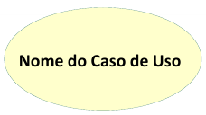
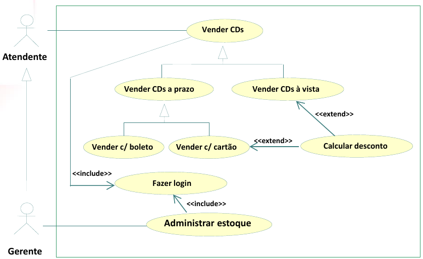

# Nexus
*(Coloque aqui o nome do seu projeto.)*

Um modelo para o desenvolvimento do Projeto Integrador do Curso de Técnico em Desenvolvimento de Sistemas para a Internet Integrado ao Ensino Médio do IFC - Campus Araquari.
*(Coloque aqui uma breve descrição do seu projeto.)*

**IMPORTANTE**: [**Cadastre seu projeto nesse link**](https://docs.google.com/spreadsheets/d/1KXuMJ9TK7GPyahR_BfLwfn4ec7vX7DgiHx42vFc4E7g/edit?usp=sharing).

Professor: [Marco André Mendes](github.com/marcoandre)

Equipe:
- [Kayque A. A. Lopes](https://github.com/kayquelopes)
- [Arthur S. Machado](https://github.com/Arthur-de-Souza-Machado)
- [Daniel V. da Cunha](https://github.com/DanielVasc)
- [Murilo V. R. Garcia](https://github.com/Murilovr1)
- [Jeffrey N. C. de Deus](https://github.com/jeffreynicolas)
- [Brayan Pedroso de Mattos](https://github.com/brayanpedroso)

Links do projeto:
(*Coloque aqui os links para a documentação do projeto e os repositórios e plubicação do backend e frontend.*)
-   [Documentação (esse documento)](github.com/marcoandre/pi-modelo)
-   Backend: [Repositório](https://github.com/kayquelopes/Backend-Nexus) e [Publicação](https://pi-backend.herokuapp.com/)
-   Frontend: [Repositório](https://github.com/kayquelopes/Front-Nexus) e [Publicação](https://pi-frontend.herokuapp.com/)

# 1. Desenvolvimento

**Site de leitura HQs**

 Nexus é um site criado com o objetivo de oferecer leitura gratuita de histórias em quadrinhos. A ideia surgiu a partir do Daniel e foi rapidamente aceita pelo grupo, já que muitos dos integrantes são fãs de HQs, especialmente as da Marvel. O grupo ficou muito animado por terem esse amor compartilhado por esse universo, o grupo decidiu transformar essa paixão em um projeto real, dando origem ao site Nexus.

# 2. Situação Problema

 Atualmente, muitos sites de leitura de histórias em quadrinhos enfrentam problemas com o histórico de leitura, que frequentemente apresenta falhas ou bugs. Isso dificulta a experiência dos usuários, que acabam tendo que procurar manualmente o capítulo onde pararam, o que atrasa e desmotiva a leitura.

Outro ponto crítico é a falta de acessibilidade para dispositivos móveis, um aspecto frequentemente ignorado por desenvolvedores de sites desse tipo. Isso afeta diretamente a usabilidade, já que grande parte dos leitores utilizam smartphones e tablets para acessar o conteúdo.

Além disso, há uma carência de espaço para os criadores independentes de HQs. Muitos artistas talentosos não têm suas obras valorizadas e divulgadas, dificultando o reconhecimento de seu trabalho.

Com o Nexus, nossa principal proposta é melhorar a acessibilidade, tanto para os leitores quanto para os criadores de conteúdo. Queremos oferecer uma plataforma fluida, funcional em todos os dispositivos, e que também sirva como vitrine para novos talentos conquistarem seu espaço.

# 3. Descrição da proposta

Dentro da nossa proposta, definimos três funções principais que serão as metas centrais do Nexus:
-  Sistema de histórico eficiente – Um sistema limpo, funcional e intuitivo, que permita ao usuário retomar a leitura exatamente de onde parou, sem complicações ou falhas.

-  Acessibilidade em dispositivos móveis – Garantir que toda a experiência no site seja totalmente adaptada e otimizada para celulares e tablets, oferecendo conforto e praticidade em qualquer tela.

-  Espaço para criadores independentes – Disponibilizar uma plataforma aberta para que artistas possam postar suas HQs, ganhando visibilidade e reconhecimento pelo seu trabalho.

Além disso, o Nexus contará com diferentes formas de acesso, de acordo com o perfil de cada usuário:

-  Administrador: responsável pela gestão do site, controle de conteúdo e manutenção geral da plataforma.

-  Criador de conteúdo: usuário que pode postar suas próprias HQs, acompanhar estatísticas e interagir com os leitores.

-  Leitor: usuário comum, que pode navegar pelo catálogo, favoritar obras e acompanhar sua leitura com um sistema de histórico personalizado.

# 4. Modelagem de Dados

# Regras de negócio (RNs)

## Cadastro de Usuários

- **RN01**: O sistema permitirá o cadastro de usuários com nome, e-mail e senha.
- **RN02**: O e-mail cadastrado deve ser único no sistema.
- **RN03**: O sistema enviará um e-mail de confirmação após o cadastro.

## Publicação de HQs

- **RN04**: Criadores de conteúdo poderão publicar HQs com título, descrição e capítulos.
- **RN05**: O criador poderá editar ou excluir suas próprias HQs a qualquer momento.
- **RN06**: HQs publicadas serão visíveis para todos os usuários.

## Sistema de Favoritos

- **RN07**: O sistema permitirá que os usuários adicionem HQs aos seus favoritos.
- **RN08**: Os usuários poderão visualizar suas HQs favoritas em uma lista separada.

## Histórico de Leitura

- **RN09**: O sistema manterá o histórico de leitura do usuário.
- **RN10**: O usuário poderá retomar a leitura do ponto onde parou.

## Comentários

- **RN11**: Os usuários poderão comentar nas HQs.
- **RN12**: Criadores de conteúdo poderão gerenciar os comentários de suas próprias HQs.

## Tipos de Usuários

- **RN13**: O sistema terá três tipos de usuários: Leitor, Criador de conteúdo e Administrador.
- **RN14**: O Administrador terá permissões para gerenciar conteúdo e usuários.

# Requisitos funcionais (RF)

##  Create (Criar)

- **RF01**: O sistema deve permitir o cadastro de novos usuários.  
  **Dados necessários**: nome, e-mail, senha, preferências de leitura.

- **RF02**: O sistema deve permitir o envio de HQs por criadores de conteúdo.  
  **Dados necessários**: título da HQ, descrição, gênero, capítulos (com arquivos de imagem), autor.

- **RF03**: O sistema deve permitir a publicação de capítulos dentro de uma HQ.  
  **Dados necessários**: título do capítulo, texto/descrição, imagens (se houver), número do capítulo, data de publicação.

- **RF04**: O sistema deve permitir que usuários adicionem HQs aos seus favoritos.  
  **Dados necessários**: ID da HQ, ID do usuário.

- **RF05**: O sistema deve permitir que usuários façam comentários em HQs.  
  **Dados necessários**: ID do comentário, texto do comentário, ID do usuário, data de postagem.

- **RF06**: O sistema deve registrar automaticamente o progresso de leitura (histórico).  
  **Dados necessários**: ID do usuário, ID da HQ, ID do capítulo, data e hora do progresso.

##  Read (Ler/Visualizar)

- **RF07**: O sistema deve permitir a visualização do catálogo de HQs com filtros de busca.  
  **Dados necessários**: título da HQ, autor, gênero, popularidade, data de publicação.

- **RF08**: O sistema deve permitir que usuários visualizem detalhes de cada HQ (capa, sinopse, capítulos).  
  **Dados necessários**: título da HQ, sinopse, lista de capítulos (com número e título), capa, autor, gênero.

- **RF09**: O sistema deve permitir a visualização do histórico de leitura do usuário.  
  **Dados necessários**: ID do usuário, ID da HQ, ID do capítulo, data e hora do progresso, status da leitura.

- **RF10**: O sistema deve permitir a visualização de HQs favoritas.  
  **Dados necessários**: ID do usuário, lista de HQs favoritas (título, autor).

- **RF11**: O sistema deve permitir a visualização de estatísticas básicas (ex: visualizações de uma HQ, HQs mais lidas).  
  **Dados necessários**: número de visualizações, número de favoritos, número de comentários.

- **RF12**: O sistema deve permitir que os usuários vejam os comentários de cada HQ.  
  **Dados necessários**: ID da HQ, lista de comentários (texto, data, autor).

##  Update (Atualizar)

- **RF13**: O sistema deve permitir que usuários editem seus perfis (nome, senha, etc.).  
  **Dados necessários**: nome, e-mail, senha, foto de perfil.

- **RF14**: O sistema deve permitir que criadores editem suas HQs e capítulos (título, descrição, imagens).  
  **Dados necessários**: título da HQ, descrição da HQ, lista de capítulos (título, descrição, imagens, texto).

- **RF15**: O sistema deve atualizar automaticamente o histórico de leitura quando o usuário avança de capítulo.  
  **Dados necessários**: ID do usuário, ID da HQ, ID do capítulo, data e hora da leitura.

##  Delete (Excluir)

- **RF16**: O sistema deve permitir que usuários removam HQs dos seus favoritos.  
  **Dados necessários**: ID da HQ, ID do usuário.

- **RF17**: O sistema deve permitir que criadores excluam suas HQs ou capítulos.  
  **Dados necessários**: ID da HQ, ID do capítulo, justificativa para exclusão.

- **RF18**: O sistema deve permitir que administradores excluam HQs ou usuários com justificativa.  
  **Dados necessários**: ID da HQ, ID do usuário, justificativa para exclusão.

# Requisitos não funcionais (RNF)

## Usabilidade e Acessibilidade

- **RNF001**: O sistema deverá ter uma paleta de cores clara e escura.
- **RNF002**: O sistema deve manter o capítulo que o usuário está lendo, mesmo após fechar o site.
- **RNF003**: O sistema deve ser de possível acesso para todos os dispositivos móveis (smartphones e tablets).
- **RNF004**: O sistema deve ser responsivo, ajustando-se a diferentes tamanhos de tela.
- **RNF005**: O sistema deve permitir que o usuário altere suas preferências de leitura, como o tamanho da fonte e o tema.
- **RNF006**: O sistema deve fornecer feedback claro para o usuário, como mensagens de erro ou confirmações de ação, de forma legível e compreensível.

## Desempenho

- **RNF007**: O site deve ser otimizado para carregar rapidamente, com tempo de resposta inferior a 3 segundos.
- **RNF008**: O sistema deve ter um tempo de inatividade máximo de 1 hora por mês para manutenção, evitando interrupções no serviço.

## Compatibilidade

- **RNF009**: O sistema deve ser compatível com os navegadores mais utilizados (Chrome, Firefox, Safari, Edge).

## Segurança e Integridade de Dados

- **RNF011**: O sistema deve garantir a integridade dos dados, prevenindo perdas de dados em caso de falhas inesperadas.

## Escalabilidade

- **RNF012**: O sistema deve ser escalável, permitindo a adição de novas funcionalidades sem prejudicar a performance.

# 7. Diagrama de Caso de Uso

**7.1 Introdução**

O diagrama de caso de uso é uma ferramenta de modelagem que descreve o comportamento de um sistema a partir da perspectiva do usuário. Ele é usado para capturar os requisitos funcionais de um sistema.

- Especificam a visão externa do sistema.
- Descrevem como o sistema é percebido por seus usuários.
- Descrevem as interações entre os usuários e o sistema.

**Os casos de uso:**
- Descrevem como os **usuários interagem com o sistema** (as funcionalidades do sistema)
- Facilitam a **organização dos requisitos** de um sistema.
- Dão uma **visão externa** do sistema
- O conjunto de casos de uso deve ser capaz de comunicar a **funcionalidade** e o **comportamento** do sistema para o cliente.
- Descrevem **o que** o sistema faz, mas **não** especificam **como** isso deve ser feito.

**7.2 Elementos do diagrama de caso de uso**

7.2.1 **Atores**

- Representam os papéis desempenhados por **elementos externos** ao sistema
  - Ex: humano (usuário), dispositivo de hardware ou outro sistema (cliente)
- Elementos que **interagem** com o sistema

Notação:

**Exemplo: Loja de CDs**

**Identificando os atores**
- Uma loja de CDs possui discos para venda. Um cliente pode comprar uma quantidade ilimitada de discos para isto ele deve se dirigir à loja.
- A loja possui um **atendente** cuja função é atender os clientes durante a venda dos discos. A loja também possui um **gerente** cuja função é administrar o estoque para que não faltem discos. Além disso é ele quem dá folga ao atendente, ou seja, ele também atende os clientes durante a venda dos discos.

**E o cliente?**
- Não é ator pois ele **não interage** com o sistema!

**7.2.2 Casos de uso**

- Representam **funcionalidades** do sistema (requisitos funcionais).
- São iniciados por **atores** ou por outros casos de uso.

> **Dica**: nomeie os casos de uso com **verbos** no **infinitivo**.

Notação:

**Exemplo: Loja de CDs**

**Identificando os casos de uso**

- Uma loja de CDs possui discos para venda. Um cliente pode comprar uma quantidade ilimitada de discos para isto ele deve se dirigir à loja. A loja possui um atendente cuja função é atender os clientes durante a **venda dos discos**.
- A loja também possui um gerente cuja função é **administrar o estoque** para que não faltem discos. Além disso é ele quem dá folga ao atendente, ou seja, ele também atende os clientes durante a **venda dos discos**.

**7.2.3 Relacionamentos**

**7.2.3.1 Relacionamento de associação**

- Indica que um ator **participa** de um caso de uso, ou seja, o ator **interage** (comunica-se) com o caso de uso.
- É representado por uma **linha sólida**.
- Um ator pode se relacionar com **um ou mais casos de uso**.

> Dicas:
> - Não use setas nas linhas de associação.
> - Associações não representam fluxo de informação.

**Exemplo: Loja de CDs**

**Identificando os relacionamentos de associação**

- Uma loja de CDs possui discos para venda. Um cliente pode comprar uma quantidade ilimitada de discos para isto ele deve se dirigir à loja. A loja possui um _atendente_ cuja função é atender os clientes durante a **venda dos discos**.
- A loja também possui um _gerente_ cuja função é **administrar o estoque** para que não faltem discos. Além disso é ele quem dá folga ao _atendente_, ou seja, ele também atende os clientes durante a **venda dos discos**.

**7.2.3.2 Relacionamento de generalização/especialização**

**Generalização de atores**

- Quando dois ou mais atores podem se **comunicar com o mesmo conjunto de casos de uso**.
- Indica que um ator **herda** as características de outro ator.
– Um filho (herdeiro) pode se comunicar com todos os casos de uso que seu pai se comunica.

> **Dica:** coloque os herdeiros **embaixo**.

**Notação:**

**Exemplo: Loja de CDs**

**Identificando os relacionamentos de generalização/especialização de atores**

**Generalização de casos de uso**

– O caso de uso filho herda o comportamento e o significado do caso de uso pai.
– O caso de uso filho pode incluir ou sobrescrever o comportamento do caso de uso pai.
– O caso de uso filho pode substituir o caso de uso pai em qualquer lugar que ele apareça.

> **Dica:** deve ser aplicada quando uma condição resulta na definição de
diversos fluxos alternativos.

Notação:

**Exemplo: Loja de CDs**

**Identificando os relacionamentos de generalização/especialização de casos de uso**

**Novos requisitos:**

- As vendas podem ser **à vista** ou **a prazo**. Em ambos os casos o estoque é
atualizado e uma nota fiscal, entregue ao consumidor.
- No caso de uma **venda à vista**, clientes cadastrados na loja e que compram mais de 5 CDs de uma só vez ganham um desconto de 1% para cada ano de cadastro.
- No caso de uma **venda a prazo**, ela pode ser parcelada em 2 pagamentos com um
acréscimo de 20%. As vendas a prazo podem ser pagas no **cartão** ou no **boleto**.
  - Para pagamento com **boleto**, são gerados boletos bancários que são entregues ao cliente e armazenados no sistema para lançamento posterior no caixa.
  - Para pagamento com **cartão**, os clientes com mais de 10 anos de cadastro na loja ganham o mesmo desconto das compras à vista.

**Identificando mais relacionamentos de generalização/especialização de casos de uso**

**7.2.3.3 Relacionamento de dependência**

**Extensão**

- Representa uma variação/extensão do comportamento do caso de uso base.
- O caso de uso estendido só é executado sob certas circunstâncias.
- Separa partes obrigatórias de partes opcionais.
  - Partes obrigatórias: caso de uso base.
  - Partes opcionais: caso de uso estendido.
- Fatorar comportamentos variantes do sistema (podendo reusar este comportamento
em outros casos de uso).

**Notação:**

 - notação")

**Exemplo: Loja de CDs**

**Identificando os relacionamentos de dependência (extensão)**

**Novos requisitos:**
- No caso de uma venda à vista, clientes cadastrados na loja e que compram mais
de 5 CDs de uma só vez ganham um **desconto** de 1% para cada ano de cadastro.
- No caso de uma venda a prazo...
  - ...Para pagamento com cartão, os clientes com mais de 10 anos de cadastro na loja ganham o mesmo **desconto** das compras à vista.

")

**Inclusão**

- Evita repetição ao fatorar uma atividade
comum a dois ou mais casos de uso.
- Um caso de uso pode incluir vários casos de uso.

**Notação:**

 - notação")

**Exemplo: Loja de CDs**

**Novos requisitos:**
Para efetuar vendas ou administrar estoque, atendentes e gerentes terão que **validar** suas respectivas senhas de
acesso ao sistema.

")

**7.2.4 Fronteira do sistema**

- Elemento opcional (mas essencial para um bom
entendimento).
- Serve para definir a área de atuação do sistema, ou seja, seus limites.

**Identificando a fronteira do sistema**

---

